# Get started with setting up and running the Nether sample

[TO DO]

## Development Machine Setup

The goal of Nether is to be available on both Windows and OSX (Mac), hence any up to date version of those operating systems should be ok. It is more about selecting your preferred IDE for your selected operating system.

### IDE: Visual Studio or Visual Studio Code

Since this project strives for cross platform compatibility, we support both [Visual Studio Code](https://code.visualstudio.com) and [Visual Studio 2017](https://www.visualstudio.com/vs/). When using Visual Studio 2017, any edition (including the free community edition) will suffice.

These can be installed on your own computer, or you can use any of the provided Microsoft Azure VM Images [here](https://azuremarketplace.microsoft.com/en-us/marketplace/apps/category/compute?page=1&search=visual%20studio) that already contains Visual Studio 2017 and the Azure SDK 2.9.1 or later.


### Prerequisites

**Azure Powershell**

Nether has been designed to take advantage of various services that are part of the Microsoft Azure platform. This includes but is not limited to hosting the REST APIs that are Nether. As such, our default "production" deployment scripts are based on Azure and currently require use of the PowerShell cmdlets for Azure.

Azure Powershell is available via the [Web Platform Installer](https://www.microsoft.com/web/downloads/platform.aspx) or by issuing the command "install-module AzureRM" from the PowerShell command line. For more about the Azure Powershell Cmdlets, please see the [official documentation](https://docs.microsoft.com/en-us/powershell/).


## Set up Azure Services

### Using PowerShell

Open the Powershell command prompt and navigate to the cloned Nether github repository.
Login to your Azure account as follows:

``` powershell
Login-AzureRmAccount
```

Then run the deployment script:
```powershell
.\deployment\deployIngest.ps1
```

The parameters are as follows:

Parameter | Comments
---------|----------
 ```ResourceGroupName``` | Name of the resource group to create in your Azure subscription
 ```Location``` | Location in which the resource group and its resource will be created, e.g. northeurope, eastus, koreacentral
 ```DataLakeAnalyticsName``` | Name of the Azure Data Lake Analytics account (to run queries on e.g. daily active users or geoclustering)
 ```DataLakeStoreName``` | Name of the Azure Data Lake Store account (to store the data)
 ```StorageAccountName``` | Name of the storage account as an alternative to store all ingested data
 ```EventHubName``` | Name of the event hub for ingesting all messages from the game client, e.g. analytics
 ```NamespaceName``` | Name of the namespace of the event hub, e.g. mygameingest
 ```AADApplicationName``` | Name of an application that will be registered with the Azure Active Directory
 ```AADApplicationPassword``` | Password of the beforementioned application (registered with your Azure Active Directory)
 ```SubscriptionName``` | Name of your Azure subscription, e.g. MSDN Visual Studio. Especially relevant if you have multiple Azure subscriptions.
 ```DirectoryName``` | Name of your directory

The deployment script will open the Visual Studio solution ``Nether.Ingest.sln`` after deploying all necessary resources in your Azure subscription and setting all necessary environment variables.

#### How do I find the name of my subscription?

Using Powershell:

``` powershell
(Get-AzureRmSubscription).SubscriptionName
```

In the portal:

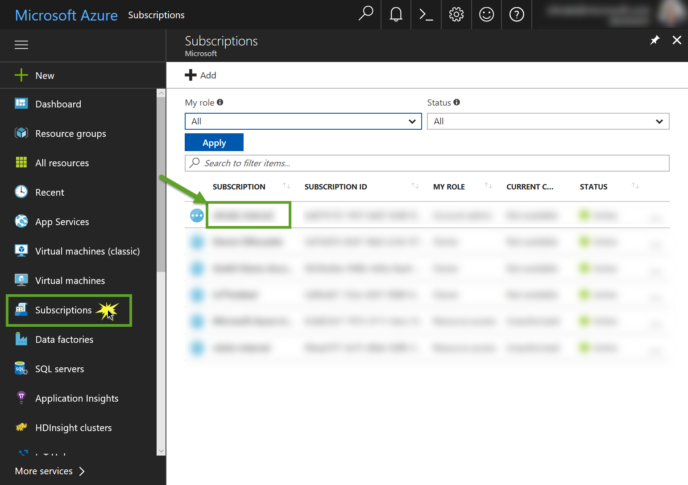

#### How do I find the name of my directory?

In the portal:

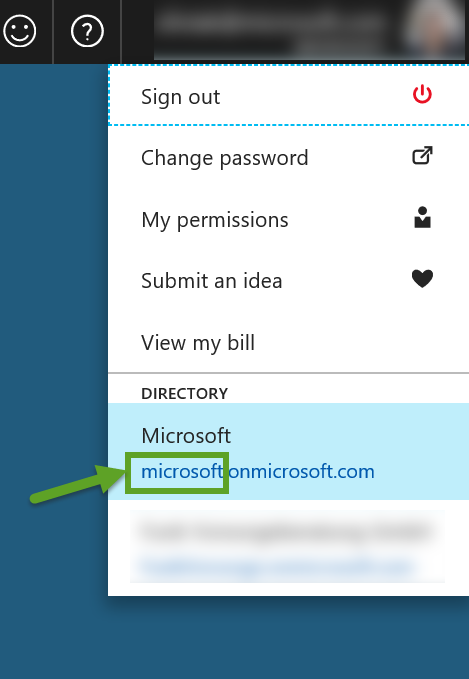

On the top right corner of the portal, click on your picture. In the dropdown list you will find a list of directories associated with your account. The directory name is the one before ``.onmicrosoft.com``.

### Using the Azure Portal

#### 1. Resource Group

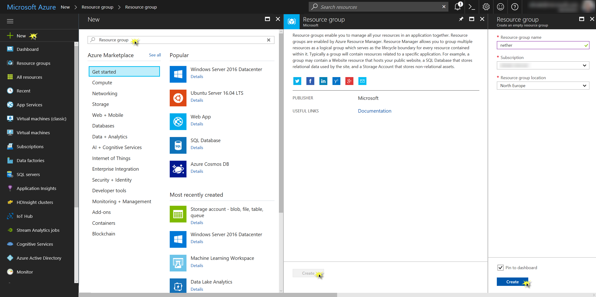

#### 2. Storage Account

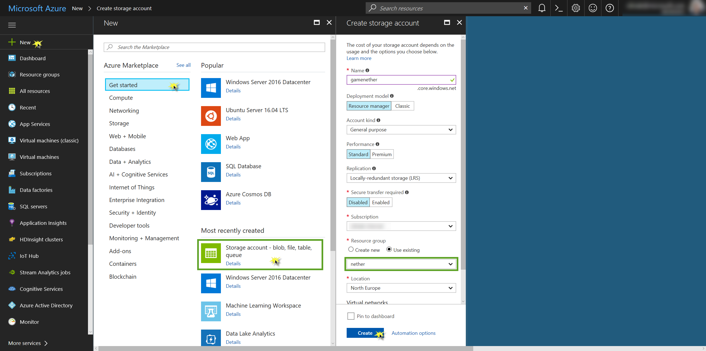

#### 3. Event Hub

Create a namespace for an event hub as follows:

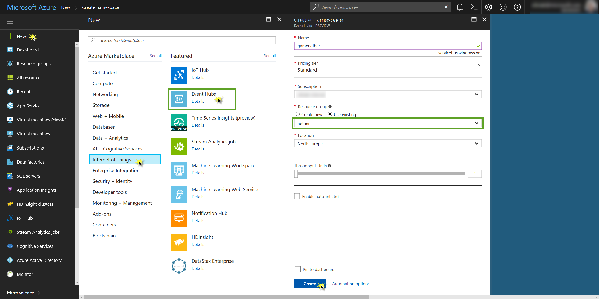

Add an event hub to the just created namespace:

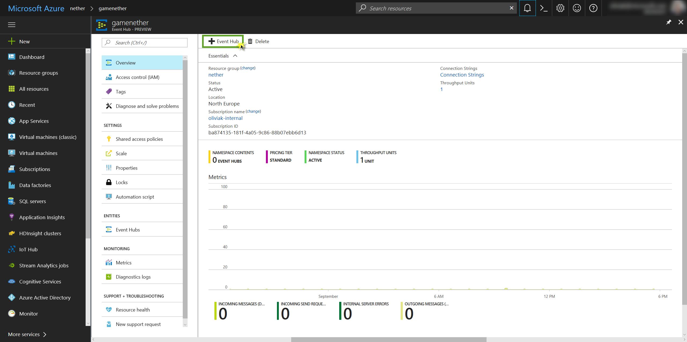

Optionally you can enable capturing in the event hub and choose the storage account from the step before:


Create a container in the previously create storage account:

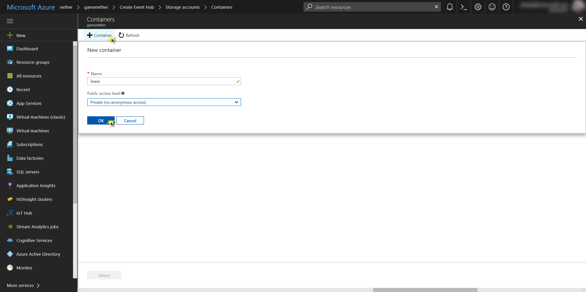

Click on create:

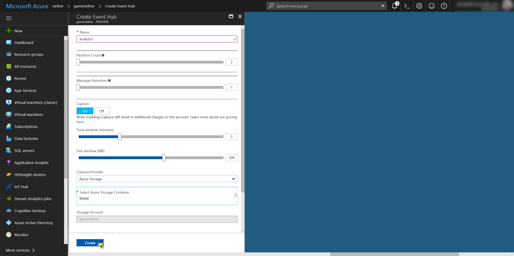

Add a consumer group to the event hub:

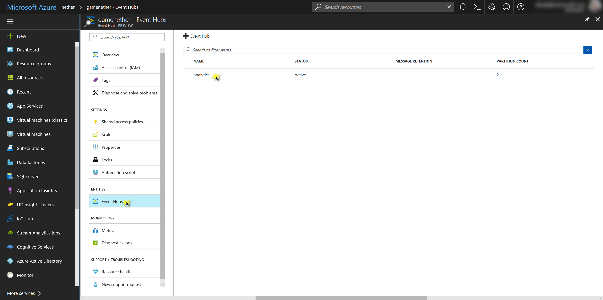

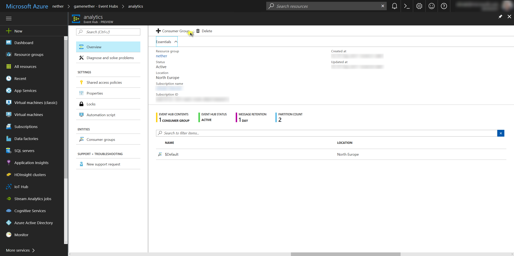


#### 4. Azure Data Lake Analytics and Store account

Whilst creating an account with Azure Data Lake Analytics (in short: ADLA), one can create a new Azure Data Lake Store (in short: ADLS) account with which the ADLA account will be associated.

Create an **Azure Data Lake Analytics** account by navigating as pictured in the graph:

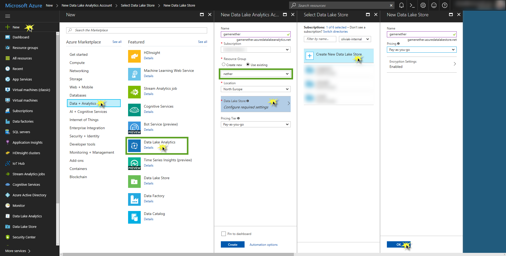


#### 5. Azure Active Directory

Navigate to the [Azure portal](http://portal.azure.com) and to the **Active Directory**. Click on **App registrations** to create a **New application registration**:

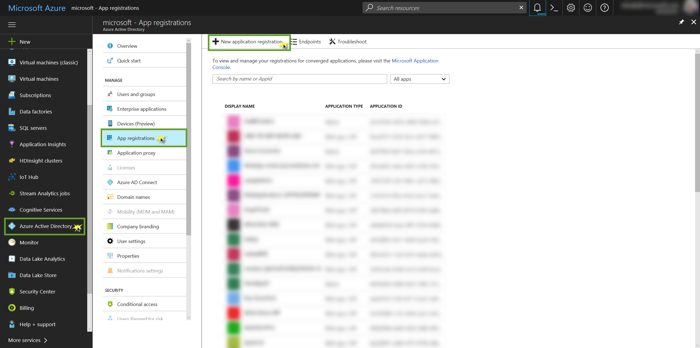

Choose a name for the new application, set the type to **Web app / API** and specify any sign-on URL (you can also take the URL of Nether's GitHub repository):

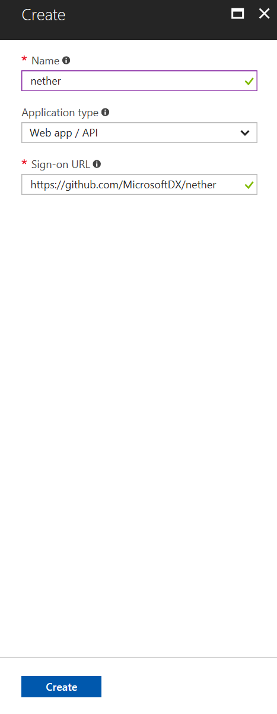

Add the app that you have registered as an owner to your resource group as follows:

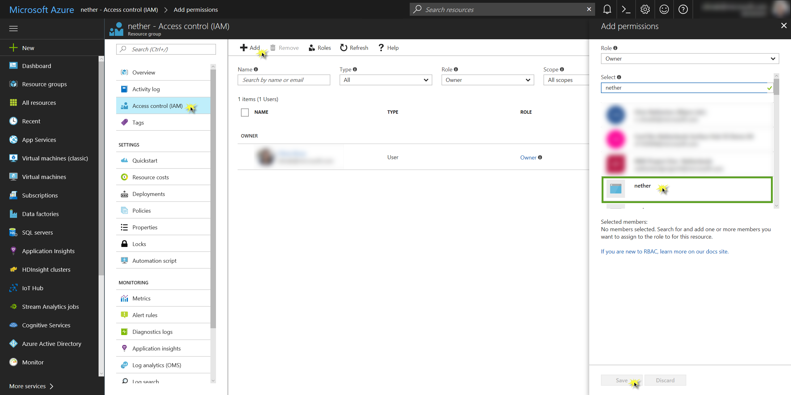

The registered app is now an owner of your resource group:

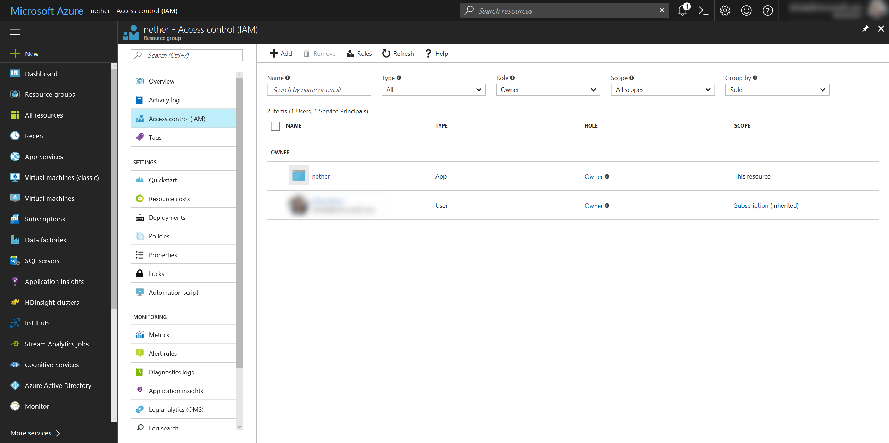


#### 6. Set the correct environment variables
Setup-NetherAnalytics.ps1
Before launching the Nether Ingest solution, set the correct environment variables using the PowerShell script [Setup-NetherAnalytics.ps1](../../scripts/Setup-NetherAnalytics.ps1).
Open a Powershell command prompt and set the environment variables in it according to the resources you have set:


```powershell
$env:NAH_EHLISTENER_CONNECTIONSTRING = "Endpoint=sb://nether.servicebus.windows.net/;SharedAccessKeyName=RootManageSharedAccessKey;SharedAccessKey=h16jv6nc0...u2YH+U2xg0YI14="
$env:NAH_EHLISTENER_EVENTHUBPATH = "analytics"
$env:NAH_EHLISTENER_CONSUMERGROUP = "nether"
$env:NAH_EHLISTENER_STORAGECONNECTIONSTRING = "DefaultEndpointsProtocol=https;AccountName=netherdashboard;AccountKey=oT30a8/BSwTFg/4GGWLPCeGIHBfgDcMf...yJMoX2lvTnWSIrjtwU9kg9YaL0Qw==;EndpointSuffix=core.windows.net"
$env:NAH_EHLISTENER_LEASECONTAINERNAME = "sync"
$env:NAH_AAD_DOMAIN = "microsoft.onmicrosoft.com"
$env:NAH_AAD_CLIENTID = "b43e3e6c-77...-a3683b27e546"
$env:NAH_AAD_CLIENTSECRET = "QxoNhF1csZV...3yil9Etnp4bw="
$env:NAH_AZURE_SUBSCRIPTIONID = "3a856395-1...5d-527c857e5995"
$env:NAH_AZURE_DLSOUTPUTMANAGER_ACCOUNTNAME = "nether"
$env:NAH_AZURE_DLA_ACCOUNTNAME = "nether"
$env:NAH_FileOutputManager_LocalDataFolder = "c:\tmp\USQLDataRoot"
```

Parameter | Comments
---------|----------
 ```NAH_EHLISTENER_CONNECTIONSTRING``` | Connection string of your event hub
 ```NAH_EHLISTENER_EVENTHUBPATH``` | Name of your event hub
 ```NAH_EHLISTENER_CONSUMERGROUP``` | Name of the consumer group added to your event hub
 ```NAH_EHLISTENER_STORAGECONNECTIONSTRING``` | Connection string of your storage account
 ```NAH_EHLISTENER_LEASECONTAINERNAME``` | Name of the container set up for event hub capturing
 ```NAH_AAD_DOMAIN``` | Name of your directory, i.e. the prefix before ``onmicrosoft.com``
 ```NAH_AAD_CLIENTID``` | Client ID of the application that you have registered within your Azure Active Directory. See [here](#How-to-find-the-client-ID-of-my-registered-application) for more instructions.
 ```NAH_AAD_CLIENTSECRET``` | Key of the application that you have registered within your Azure Active Directory. See [here](#How-to-find-the-client-secret-of-my-registered-application) for more instructions.
 ```NAH_AZURE_SUBSCRIPTIONID``` | Your Azure subscription ID. See [here](####how-to-find-my-subscription-id) for further instructions.
 ```NAH_AZURE_DLSOUTPUTMANAGER_ACCOUNTNAME``` | Name of your Azure Data Lake Store account
 ```NAH_AZURE_DLA_ACCOUNTNAME``` | Name of your Azure Data Lake Analytics account.
 ```NAH_FileOutputManager_LocalDataFolder``` | Path to local folder where ingested messages will be stored too

#### How to find the client ID of my registered application

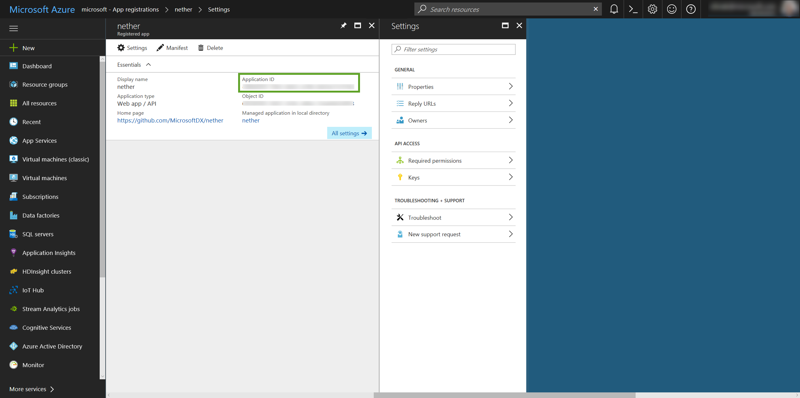

#### How to find the client secret of my registered application

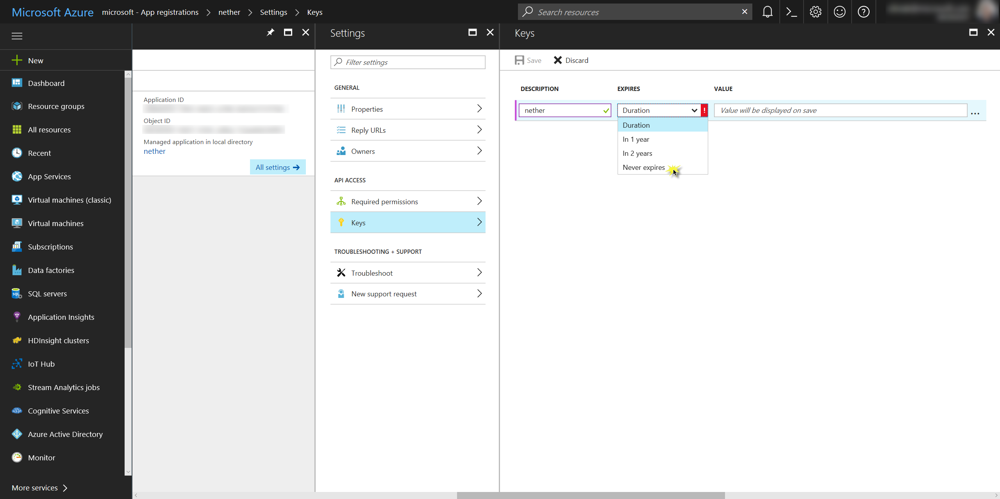

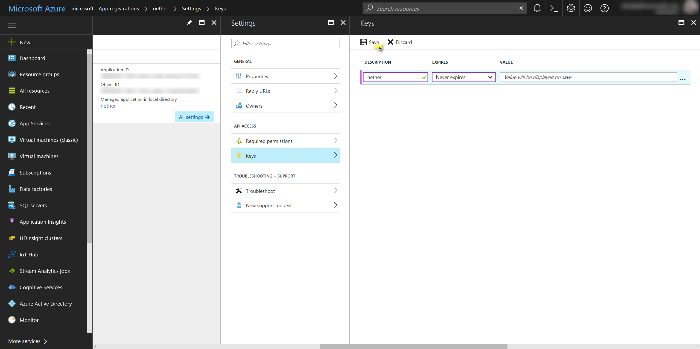

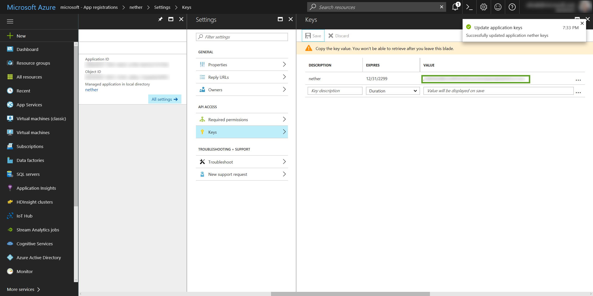

#### How to find my subscription ID


## Run the console application

If not opened already, open ``Nether.Ingest.sln`` in Visual Studio.
Set the startup projects as follows:

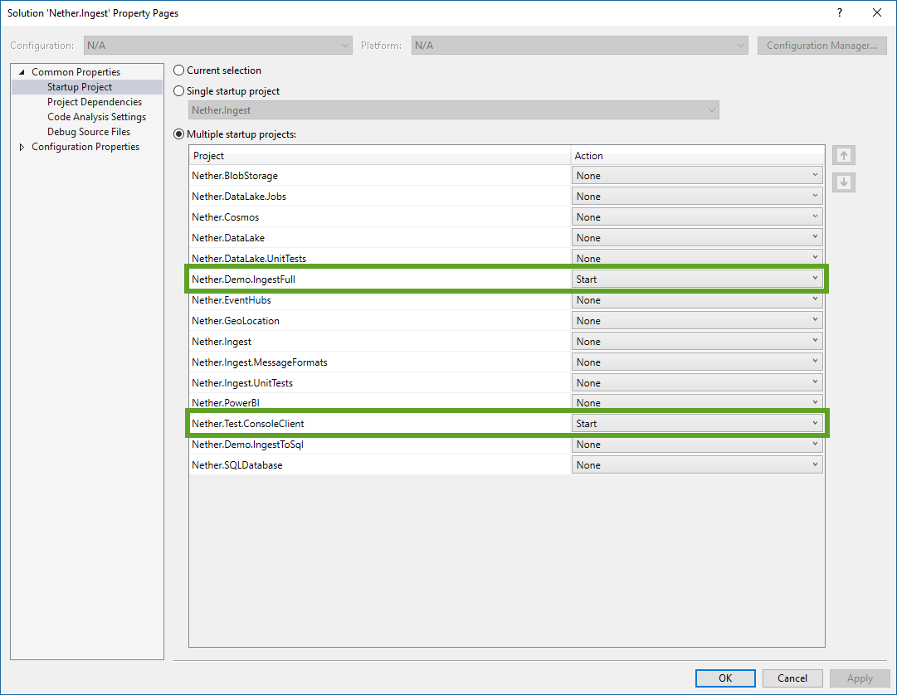

You can start it!